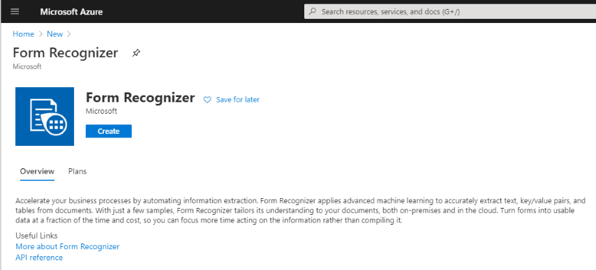
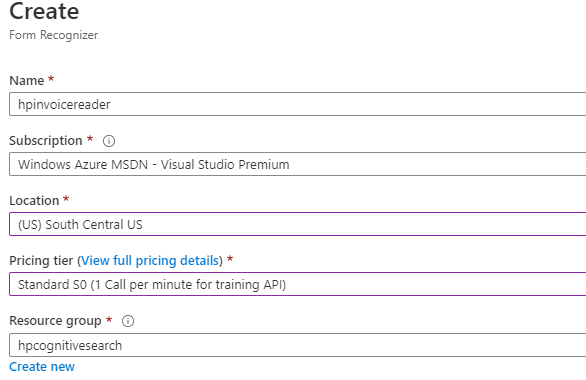
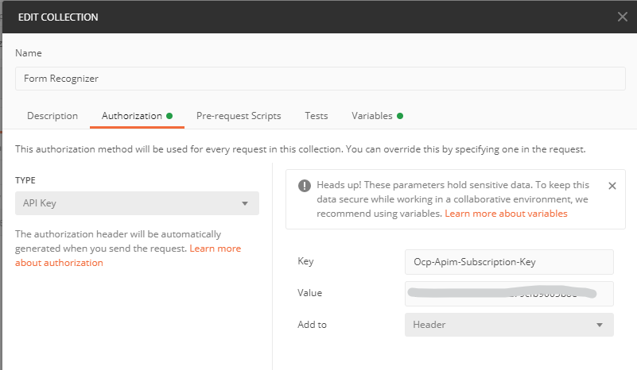
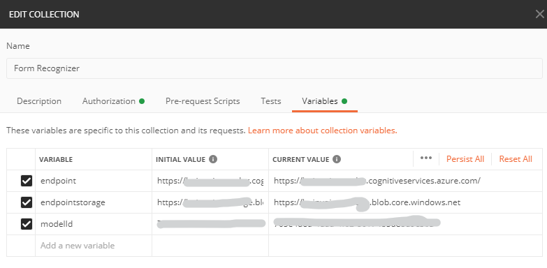
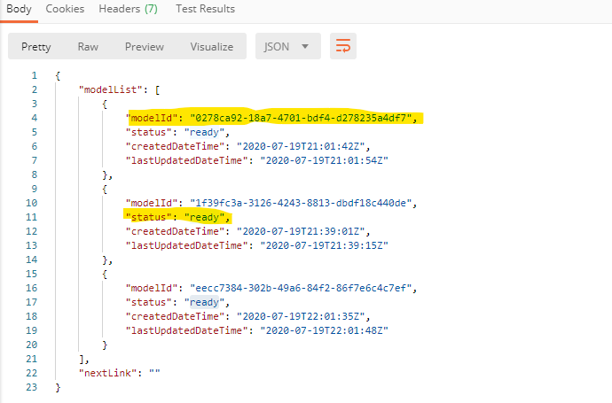
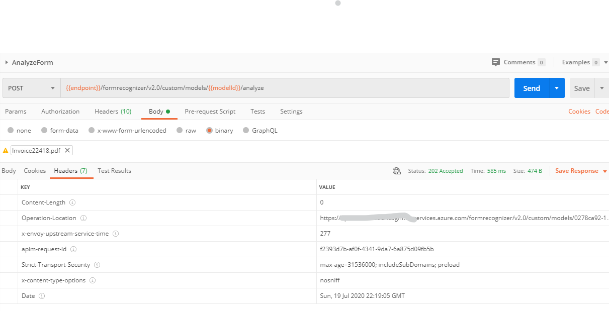
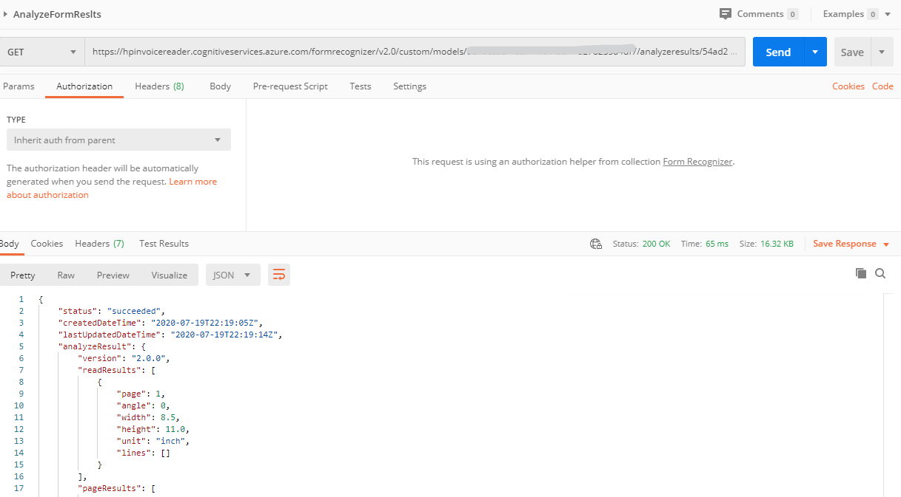

## Demo 2 - Using Form Recognizer

[](https://globaleventcdn.blob.core.windows.net/assets/aiml/aiml10/videos/Demo2.mp4 "Demo 2")

#### The video was made using the pre-release api.  It still shows the steps needed, but a few things have changed.  The text below has the correct updates

## Summary
In this exercise we learn how to use the Form Recognizer service. It is assumed that a storage account has been created (as described in the [first demo](demo1.md).)


## What you need
- [Invoice Training Set](https://globaleventcdn.blob.core.windows.net/assets/aiml/aiml10/data/training.zip)

- [Postman](https://www.getpostman.com/) is used to send requests to the Form Recognizer service REST API. Refer to this [short primer](postman.md) to learn more.

- Postman Form Recognizer requests [collection](src/Collections/Form_Recognizer.postman_collection.json).

## Azure Resources
The only resource we work with in this demonstration is the Form Recognizer service.


| Name                       | Type                            | Purpose                    |
| -------------------------- | ------------------------------- | ------------------------- |
| **ttinvoicereader**       | Form Recognizer Service         | This service will eventually end up in the All-In-One sevice. For right now it is in limited-access preview. To get access to the preview, fill out and submit the [Form Recognizer access request](https://aka.ms/FormRecognizerRequestAccess) form.  |


## What to do

There are three main steps:
1. Upload training data to the storage account
2. Create Form Recognizer service
3. Train and Use Form Recognizer service

### Upload Training Data


1. Create a container called `train` in the storage account created in the previous demo.

[](https://docs.microsoft.com/en-us/azure/storage/blobs/storage-quickstart-blobs-portal?WT.mc_id=msignitethetour2019-github-aiml10 "Create Container")

2. Download and unzip [invoice training set](https://globaleventcdn.blob.core.windows.net/assets/aiml/aiml10/data/training.zip).

3. Upload unzipped [invoice training set](https://globaleventcdn.blob.core.windows.net/assets/aiml/aiml10/data/training.zip) to the `train` container. This can be done directly using the [portal](https://docs.microsoft.com/en-us/azure/storage/blobs/storage-quickstart-blobs-portal?WT.mc_id=msignitethetour2019-github-aiml10#upload-a-block-blob) or by using the [Azure Storage Explorer](https://docs.microsoft.com/en-us/azure/vs-azure-tools-storage-explorer-blobs?WT.mc_id=msignitethetour2019-github-aiml10) (as shown in the [video](https://globaleventcdn.blob.core.windows.net/assets/aiml/aiml10/videos/Demo2.mp4 "Demo 1")).

### Create Form Recognizer service

[](https://docs.microsoft.com/en-us/azure/cognitive-services/form-recognizer/overview "Form Recognizer")

Make sure to use your own unique name for this service that fits the pattern is currently established.  Pick the correct resource group and location to match your instance.

[](https://docs.microsoft.com/en-us/azure/cognitive-services/form-recognizer/overview "Form Recognizer")

### Train the Form Recognizer Service

This section uses Postman and assumes you know about loading collections, handling variables, and setting pre-request scripts. To learn how to do these specific things we have included some [instructions](postman.md).

The table below lists the variables set during this section of the exercise:

| Name                       | Type                            | Purpose                    |
| -------------------------- | ------------------------------- | ------------------------- |
| `Ocp-Apim-Subscription-Key`       | Authorization         | Key for getting access to Form Recognizer service  |
| `endpoint`       | Variable         | Specifies the Form Recognizer endpoint  |
| `endpointstorage`       | Variable         | Specifies the storage location endpoint  |
| `modelId`       | Variable         | Current Form Recognizer model (this is set in step 5)  |

1. Load the [Form Recognizer collection](src/Collections/Form_Recognizer.postman_collection.json) into Postman.

2. Set the `Ocp-Apim-Subscription-Key` authorization header as well as the `endpoint` variable to the Form Recognizer service (these can be found in the portal).




3. Open the `TrainModel` Request and change the Pre-request script to set the `storageAccount` variable to your storage account (in the video the variable is `ttinvoicestorage`) and the `SASValue` to the appropriate Secure Access Signature to the `train` container. To learn how to get a Secure Access Signature, refer to our [brief explanation](sas.md).

```javascript
pm.environment.set('storageAccount', '<YOUR STORAGE ACCOUNT>')
pm.environment.set('container', 'train')
pm.environment.set('SASQueryValue', '<GET SHARED ACCESS SIGNATURE>')
```

4. Hit Send on the Request.  You will not get a response in the.  As long as you get a 201 created as a status, this request worked.  May not have been successful, but you can check in the next step.

5. Open the **Get Models** request in  the collection.  Click the **Send** button and you should receive something that looks like:



6. Set the `modelId` variable for the collection to the returned `modelId` indicated above.  As long as the status is `ready`, then you should have a valid model.  If something goes wrong, you will need to investigate.

### Use the Form Recognizer Service

1. Open the `AnalyzeForm` request. In the **Body** section click on the `Select Files` button to choose an invoice downloaded previously. 



2. To get the results of the analysis, open the headers of the result and copy the **Operation-Location**.  Open up the **AnalyzeFormResults** and paste that location url into the top URL and hit send.  This will return a status and any results that have been found on the model.



# Next Demo
Learn how to create custom Invoice Reader Skill with Azure Functions by continuing on to [Demo 3 - Creating a Custom Invoice Reader Skill](demo3.md)
