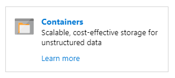
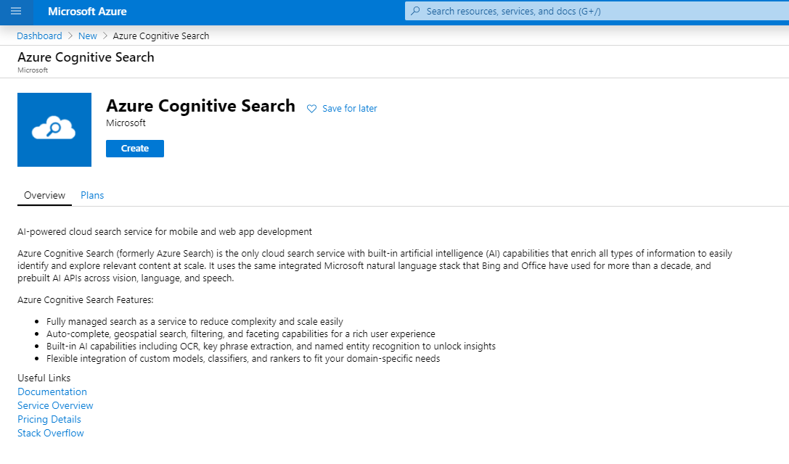
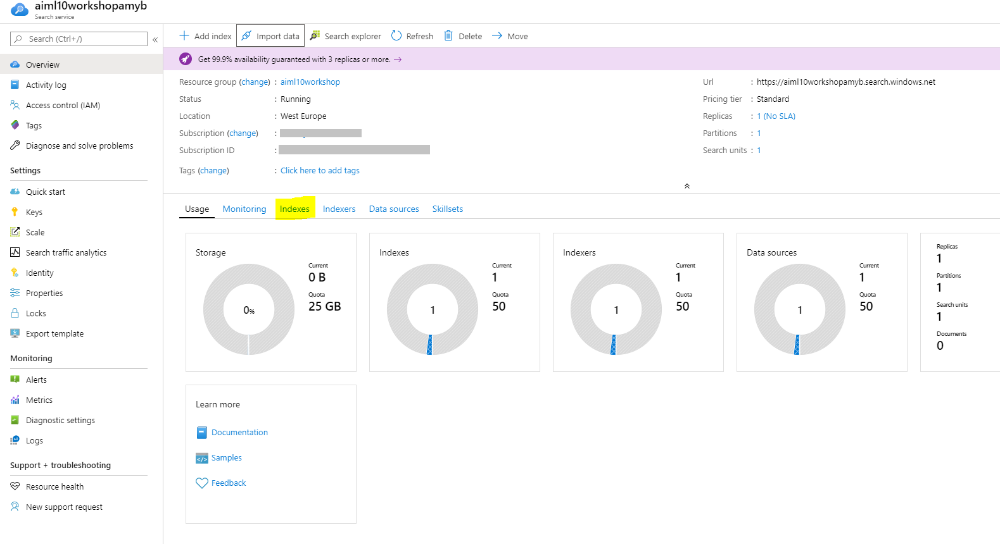

# Task 1 - Azure Cognitive Search Basics

[](https://globaleventcdn.blob.core.windows.net/assets/aiml/aiml10/videos/Demo1.mp4 "Demo 1")

## Summary
In this exercise you will demonstrate the basic functions of Azure Cognitive Search in conjunction with the built-in intelligent skillset.


## What you need
- Download the [Invoice Test Set](https://globaleventcdn.blob.core.windows.net/assets/aiml/aiml10/data/test.zip)

## Azure Resources
These are the resources that we create in the first demonstration. While this table outlines the names of the resources as shown in the video, please use your own names for each of the resources.


| Name                       | Type                            | Purpose                    |
| -------------------------- | ------------------------------- | ------------------------- |
| **ttcognitivesearch**     | Resource Group                  | Groups services together   |
| **ttinvoicestorage**      | Storage Account                 | Used to store invoices     |
| **ttinvoicesearch**       | Search Service                  | Featured service           |
| **ttinvoiceintelligence** | Cognitive Services (All-In-One) | Used in the search service |


# What to do

There are three main steps:
1. Create a Resource Group
2. Create and use a Storage Account
3. Create and use an Azure Cognitive Search Service resource


# Create a Resource Group
Log into the Azure Portal and activate the Azure Cloud Shell from the button in the top right corner of the screen


All of our resources will live in the resource group we create.

Run the following command in the cloud shell environment. Choose any Azure location (e.g. westeurope, eastus2 etc) and a name for this workshop folder

```
az group create --location {LOCATION} --name {YOUR_RG_NAME}
```


### Create and use Storage Account
The storage account is used primarily for storing the invoices we want to analyze.

1. Create storage account

```
az storage account create --name {YOUR_STORAGE_NAME} --location {LOCATION} --resource-group {YOUR_RG_NAME} --sku Standard_LRS
```

2. Create a container called `test`

Once the resource is created. Navigate in the Azure portal to your resource group and the storage account.

Select Containers



then '+ Container' and give it the name 'test' and keep permissions as private.

[](https://docs.microsoft.com/en-us/azure/storage/blobs/storage-quickstart-blobs-portal?WT.mc_id=msignitethetour2019-github-aiml10 "Create Container")

3. Download and unzip [invoice test set](https://globaleventcdn.blob.core.windows.net/assets/aiml/aiml10/data/test.zip).

4. Upload unzipped [invoice test set](https://globaleventcdn.blob.core.windows.net/assets/aiml/aiml10/data/test.zip) to the `test` container. This can be done directly using the [portal](https://docs.microsoft.com/en-us/azure/storage/blobs/storage-quickstart-blobs-portal?WT.mc_id=msignitethetour2019-github-aiml10#upload-a-block-blob) or by using the [Azure Storage Explorer](https://docs.microsoft.com/en-us/azure/vs-azure-tools-storage-explorer-blobs?WT.mc_id=msignitethetour2019-github-aiml10) application.

#### Via the Portal

* In the storage account click containers and select the 'test' container
* Choose 'Upload'
* Choose the folder icon to browse for your test invoices
* Select all your invoices and click open from file explorer
* Click Upload
* Progress of uploads are shown and once complete close the 'Upload blob' pane using the 'X'

#### Via Azure Storage Explorer

* [Download Azure Storage Explorer](https://azure.microsoft.com/en-us/features/storage-explorer/) to you local device (Windows, Linux and MacOS compatible)
* Open Azure Storage Explorer
* Connect to your Azure Subscription - [instructions available here](https://docs.microsoft.com/en-us/azure/vs-azure-tools-storage-manage-with-storage-explorer?tabs=windows#connect-to-a-storage-account-or-service)
* In the explorer window on the left navigate to your blob storage account
* Drop down blob containers icon
* You should see the container 'test' you just created. Select test and it will open in the window
* Similar to the portal - select upload, upload files
* Select all invoices from explorer and upload

# Create and use a Search Service resource

#### Create a search service:
In the Azure portal select 'Create a resource' and search for 'search' and select 'Azure Cognitive Search'

[](https://docs.microsoft.com/en-us/azure/search/search-create-service-portal?WT.mc_id=msignitethetour2019-github-aiml10 "Azure Search")

Click Create and complete the information needed to setup the service:
* **Subscription:** 'your-subscription-name-here'
* **Resource Group:** select your resource group from the dropdown
* **URL:** enter a unique name for the Azure search service, *e.g. workshopaiml10-yourinitials*
* **Location:** same location as your resource group
* **Pricing Tier:** Standard or Basic

Click Review + Create

Make sure Validation passes

Then click create

#### Use Azure Cognitive Search Service:

Once created click 'go to resource' or navigate to the service instance via your resource group.

1. In the newly created service click on `Import Data`

[](https://docs.microsoft.com/en-us/azure/search/cognitive-search-quickstart-blob?WT.mc_id=msignitethetour2019-github-aiml10#create-the-enrichment-pipeline "Import Data")

2.Use an existing connection to the `test` container we created in our storage account by select 'Azure Blob Storage' and selecting your storage account

* Name: test
* Connection String: Choose an existing connection, select storage account and test container
* Click Next

[](https://docs.microsoft.com/en-us/azure/search/cognitive-search-quickstart-blob?WT.mc_id=msignitethetour2019-github-aiml10#step-1-create-a-data-source "Import Data")

3. Create a new Cognitive Services resource

* Drop down 'Attach Cognitive Services'
* select the link: Create new Cognitive Services resource (this will open a new browser page)
* Enter name of service: ttcognitiveserv
* choose same location as your resource group
* choose pricing tier S0
* select your already created resource group
* Check the confirm box and read notice
* click create

[](https://docs.microsoft.com/en-us/azure/search/cognitive-search-quickstart-blob?WT.mc_id=msignitethetour2019-github-aiml10#step-2-add-cognitive-skills "Create Cognitive Services")

Once created navigate back to the Azure Cognitive Search browser window

4. Hit the refresh button. You should see the newly created service. 

5. Dropdown the 'Add enrichments' section. You can now add any enrichments you like! Select the 'Enable OCR ...' checkbox to have access to more enrichments based on a merged content field

We recommend you select them all during this workshop.

[](https://docs.microsoft.com/en-us/azure/search/cognitive-search-quickstart-blob?WT.mc_id=msignitethetour2019-github-aiml10#step-2-add-cognitive-skills "Add Enrichments")

6. After clicking on `Next: Customize Target Index` review the proposed index and click `Next: Create and Indexer`.

[](https://docs.microsoft.com/en-us/azure/search/cognitive-search-quickstart-blob?WT.mc_id=msignitethetour2019-github-aiml10#step-3-configure-the-index "First Index")

7. Give the new indexer a name and click `Submit`

[](https://docs.microsoft.com/en-us/azure/search/cognitive-search-quickstart-blob?WT.mc_id=msignitethetour2019-github-aiml10#step-4-configure-the-indexer "First Indexer")

8. Once the indexing has taken place feel free to try some queries:

Select Indexes on main page


Select your index name and try your first search:
* For all information indexed type * and search
* *&$select=content
* *&$select=people
* *&$select=people&$top=2

[](https://docs.microsoft.com/en-us/azure/search/cognitive-search-quickstart-blob?WT.mc_id=msignitethetour2019-github-aiml10#query-in-search-explorer "First Search")

# Next Task
Learn how to use the Form Recognizer Cognitive service by continuing on to [Task 2 - Using Form Recognizer](workshop-task2.md)