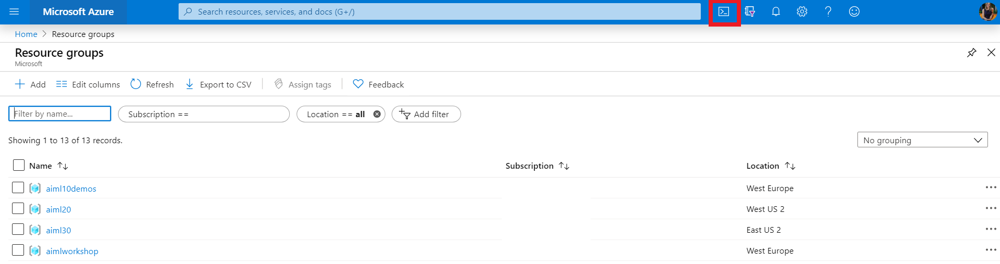

# Workshop 1: 
# Using Pre-Built AI to Solve Business Challenges

## Workshop Abstract

Tailwind Traders is a data-driven company, Tailwind Traders understands the importance of using Artificial Intelligence to improve business processes and delight customers. Before investing in an AI team, their existing developers were able to demonstrate some quick wins using pre-built AI technologies. In this session, we will show how you can use Azure Cognitive Services to extract insights from retail data. We’ll go into the neural networks behind computer vision, and show how you can augment the pre-built AI with your own images for custom image recognition applications.

## Pre-reading

* **Azure Basics**
    * I would recommend getting a basic understanding of cloud technologies and Azure (storage, VMs and networking) from [Azure Fundamentals](https://docs.microsoft.com/en-us/learn/paths/azure-fundamentals/?WT.mc_id=aimlworkshop-github-amynic) 
* **Azure AI introduction**
    * (Prebuilt AI) [Classify images](https://docs.microsoft.com/en-us/learn/paths/classify-images-with-vision-services/?WT.mc_id=aimlworkshop-github-amynic) 
    * (Prebuilt AI) [Evaluate Text](https://docs.microsoft.com/en-us/learn/paths/evaluate-text-with-language-services/?WT.mc_id=aimlworkshop-github-amynic) 
    * (Data Science) [Using Python and Azure Notebooks](https://docs.microsoft.com/en-us/learn/paths/intro-to-ml-with-python/?WT.mc_id=aimlworkshop-github-amynic)
    * (Bespoke Machine Learning) [Introduction to Azure Machine Learning](https://docs.microsoft.com/en-us/learn/paths/build-ai-solutions-with-azure-ml-service/?WT.mc_id=aimlworkshop-github-amynic)
* **General other interesting learning:**
    * (Theory/approaches) [Machine Learning Crash Course](https://docs.microsoft.com/en-us/learn/paths/ml-crash-course/?WT.mc_id=aimlworkshop-github-amynic)
    * [Principles for Responsible AI](https://docs.microsoft.com/en-us/learn/modules/responsible-ai-principles/?WT.mc_id=aimlworkshop-github-amynic)

## Pre-requisites

* Laptop with a modern web browser (Edge, Chrome etc)
* Access to a [Azure Subscription](https://azure.microsoft.com/en-us/free/students/?WT.mc_id=aimlworkshop-github-amynic)
* [Visual Studio Code](https://code.visualstudio.com/?WT.mc_id=aimlworkshop-github-amynic)
* Basic understanding of how to access code and instructions from [GitHub](https://guides.github.com/)

# Deploy the Workshop Environment:

## Clone the repository to your local machine

You will need the contents of https://github.com/amynic/ignite-learning-paths-training-aiml/tree/workshop on your local machine. The easiest way to do this is to visit the [Developer's Guide to AI Learning Paths repository](https://github.com/amynic/ignite-learning-paths-training-aiml/tree/workshop) and click the "Clone or download" button. We will refer to files relative to the `aiml20` folder.

## Deploy the Tailwind Traders website.

Click the button below. This will deploy
[TailwindTraders-Website](https://github.com/Microsoft/TailwindTraders-Website)
from Github, using an ARM template to enable the Personalizer integration and ONNX-based Shop by Photo feature. ([More details about this deployment](https://github.com/microsoft/TailwindTraders-Website/blob/master/Source/Tailwind.Traders.Web/Standalone/README.md).)

[](https://portal.azure.com/?feature.customportal=false#create/Microsoft.Template/uri/https%3A%2F%2Fraw.githubusercontent.com%2FMicrosoft%2FTailwindTraders-Website%2Fmaster%2Fazuredeploy.json)

In the form that appears, select the following options:

* Subscription: Select the subscription in which to deploy the resources

* Resource Group: resources will be created in the resource group you specify.
  We recommend choosing "New" and entering the name `aiml20-demo`. When
  you're done, you can delete this resource group to shut down the site and
  delete all associated resources.

* Location: The Azure region where the resources will be deployed. You must
  be able to deploy SQL Database and App Services in that region. 

  Note: Since Personalizer is currently only available in WestUS2 and WestEurope, it will be deployed there regardless of what you choose.

* Site Name: This will be used in the site's URL and visible publicly, and must
  be globally unique. To avoid clashes, choose `aiml20-xy` replacing `xy` with your initials, but we will refer to this name as just `aiml20` in these scripts. (If you
  choose a name that is in use, you will get "Conflict" errors during the
  deployment.)

* Site Location: Enter the short version of "Location" above, e.g. `westus2`.
  (You can get a list of short names in the Azure CLI with: `az account
  list-locations -o table`).

* Deployment mode: Choose `standalone`

* SQL Login: Enter `twt`

* SQL Password: generate and use a secure password (it must include punctuation
  and mixed case, but do not use `;`). You won't need it for our demos, so no
  need to write it down.

* Enable Personalizer: choose `true`

* Repo URL: accept the default, `https://github.com/microsoft/TailwindTraders-Website`

* Branch: accept the default, `master`

(As a backup, you can also use the Repo URL
`https://github.com/revodavid/TailwindTraders-Website` with the branch `aiml20`.
This was forked on 2019-10-25 and is known to work.)

Check "I agree to the terms and condtions" and click "Purchase".

>*This could take around 15 minutes to deploy, continue the workshop and check back later* 

The deployed website URL will be of the form SITENAME.azurewebsites.net (using the Site Name you provided above), or you can find it as follows:

* click "Go To Resource" under "Next Steps"

* Click the "App Service" resource

* Look at the "URL" value displayed in the right pane

### Install the "Simple" ONNX model

Follow the instructions in [DEMO ONNX deployment.md](DEMO%20ONNX%20deployment.md#load-the-simple-onnx-model) under the heading "Load the Simple ONNX model". This will degrade the "Shop by Photo" tool in the app to only recognize hammers and drills.

## Find the image files on your local machine

Once you have cloned the repository, you can find the training images in the `aiml20/CV Training Images` folder. You will
use these images to train the Custom Vision model. The folder contains the following subfolders:

* drills
* hammers
* hard hats
* pliers
* screwdrivers

These images will be used to test the Computer Vision service and create a model
with the Custom Vision service later on in this workshop.

*These images were sourced from Wikimedia Commons and used under their respective
Creative Commons licenses. See the file [ATTRIBUTIONS.md](https://github.com/microsoft/ignite-learning-paths-training-aiml/blob/master/aiml20/CV%20training%20images/ATTRIBUTIONS.md) for
details.*

Additional test images can be found in the `test images` folder. These images will not be used in
training, but will be used to test that our models are working.

# Task 1: Azure Cognitive Services, Computer Vision

In this task, we will use Azure Computer Vision to detect the type of object an image represents. 

* First, we will use the **Computer Vision online web-form** to upload an image and observe the results.
* Then, we will use the **Computer Vision API** to collect the same information
programatically, using curl.

## Defining the problem: Shop by Photo doesn't work right

The problem that Tailwind Traders has is the Shop by Photo tool in the Tailwind Traders website isn't correctly identifying products. Once your Azure deployment is complete:
* Go to the resource group you created
* Select your app service resource
* In the top summary information about the resource select the URL field
* This will open the Tailwind Traders website for you to review
* Find the 'start smart shopping button' - **you will need this again shortly**

## Using Computer Vision via the Web interface

Let's try using computer vision on a picture of a hardware product. If we can
identify a product that Tailwind Traders sells by name, we can search for that
name in the catalog for the "Shop by Photo" app.

1. Visit the Computer Vision webpage at
   [https://azure.microsoft.com/en-us/services/cognitive-services/computer-vision/](https://azure.microsoft.com/en-us/services/cognitive-services/computer-vision/?WT.mc_id=msignitethetour2019-github-aiml20)

2. Scroll down to the "Analyze an Image" section. It looks like this:


3. Click the "Browse" button, and choose "man in hardhat.jpg" from the "test
   images" folder in "CV Training Images".

4. After a moment, the analysis of your image will appear in the right pane. It
   looks like this:

```
FEATURE NAME:	VALUE

Objects	[ { "rectangle": { "x": 138, "y": 27, "w": 746, "h": 471 }, "object": "headwear", "confidence": 0.616 }, { "rectangle": { "x": 52, "y": 33, "w": 910, "h": 951 }, "object": "person", "confidence": 0.802 } ]

Tags	[ { "name": "man", "confidence": 0.999212 }, { "name": "headdress", "confidence": 0.99731946 }, { "name": "person", "confidence": 0.995057464 }, { "name": "clothing", "confidence": 0.991814733 }, { "name": "wearing", "confidence": 0.9827137 }, { "name": "hat", "confidence": 0.9691986 }, { "name": "helmet", "confidence": 0.9227209 }, { "name": "headgear", "confidence": 0.840476155 }, { "name": "personal protective equipment", "confidence": 0.8358513 }, { "name": "looking", "confidence": 0.832229853 }, { "name": "hard hat", "confidence": 0.8004248 }, { "name": "human face", "confidence": 0.785058737 }, { "name": "green", "confidence": 0.774940848 }, { "name": "fashion accessory", "confidence": 0.706475437 } ]

Description	{ "tags": [ "man", "headdress", "person", "clothing", "wearing", "hat", "helmet", "looking", "green", "jacket", "shirt", "standing", "head", "suit", "glasses", "yellow", "white", "large", "phone", "holding" ], "captions": [ { "text": "a man wearing a helmet", "confidence": 0.8976638 } ] }

Image format	"Jpeg"

Image dimensions	1000 x 1000

Clip art type	0

Line drawing type	0

Black and white	false

Adult content	false

Adult score	0.0126242451

Racy	false

Racy score	0.0156497136

Categories	[ { "name": "people_", "score": 0.69140625 } ]

Faces	[ { "age": 37, "gender": "Male", "faceRectangle": { "top": 419, "left": 363, "width": 398, "height": 398 } } ]

Dominant color background	"White"

Dominant color foreground	"White"

Accent Color	#90A526
```

*(Note, the above analysis may change in the future: the Computer Vision model is
updated regularly.)*

Note that in the first "Objects" result, two objects "headwear" and "person" are
detected, and their locations in the image is given. The object we want to
detect is classified "headwear", but for our application we need a more specific
classification: "hard hat". However "hard hat" is not one of the object types
that Computer Vision currently detects. (We'll address this problem with Custom
Vision, later.) Also note that a confidence score is given for each object
classification.

The second "Tags" result gives a list of labels associated with the entire
image. The tag with the highest confidence (listed first) is "man", which
doesn't help us much. The second tag, "headdress", is not exactly what we are
looking for either.

The other responses are also interesting, take a look at what's included:

* A caption for the photo ("a man wearing a helmet") in the Description field.

* Image features (is it black and white? a line drawing?)

* Details of any faces detected in the image (identified as a 37-year-old male in this case)

* A score for the content of the image: is it "Adult" or "Racy"?

* Color analysis for the image: the dominant foreground, accent, and background colors.

We're really only interested in the "Tags" field for our purposes, so we'll find
out how to extract that programatically in the next section.

## Using Computer Vision via the API

You can [control Computer Vision programatically using its REST
API](https://docs.microsoft.com/en-us/azure/cognitive-services/computer-vision/vision-api-how-to-topics/howtocallvisionapi?WT.mc_id=msignitethetour2019-github-aiml20).
You can do this from just about any language or application that has access to
the Web, but we will use [curl](https://curl.haxx.se/), a common command-line
application for interfacing with URLs and collecting their outputs. The curl
application comes pre-installed on most Linux distributions and in recent
versions of Windows 10 (1706 and later). In this workshop we will use the Azure Cloud Shell to run these commands 

Open the file [`vision_demo.sh`](vision_demo.sh) in Visual Studio Code to review the commands you are going to run

Then go to the Azure Portal and click the Azure Cloud Shell button in the top right as shown in red below



The commands in this script will:

1. Log into your Azure subscription (this step is unneccessary if using Cloud Shell)
2. Create an Azure Resource Group
3. Create a Cognitive Service key. (Note: this is an omnibus key that we will also use for Custom Vision, later.)
4. Find the key
5. Use CURL to analyze two images

Once the cloud shell in open and loaded a BASH shell - submit each of the [`vision_demo.sh`](vision_demo.sh) commands, step-by-step and review what they are doing to evaluate the test images.

# Task 2: Azure Custom Vision

In this task, we create a custom vision model using the service at
customvision.ai.

## Create a custom model project with Custom Vision

1. Sign into [Custom Vision](https://customvision.ai) and create a new project.
   [Follow the instructions
   here](https://docs.microsoft.com/azure/cognitive-services/custom-vision-service/getting-started-build-a-classifier?WT.mc_id=msignitethetour2019-github-aiml20).

2. Your new project should have the following settings:

    - Name: Tools
    - Description: Products sold by Tailwind   Traders
    - Resource: create new -> provide name and details
    - Project Type: classification
    - Classification Types: Multiclass
    - Domains: Retail (compact)
    - Export capabilities: Basic Platforms

3. In the "Tags" tool in the left side, use the "+" button to add the following tags:

    - drill
    - hammer
    - pliers
    - screwdriver

4. We will now add images for each tag from the corresponding folder in "CV Training Images". Here's how to do it for "drill"

    - Click "Add Images" in the top row
    - Browse to CV Training Images / drills
    - Select all files: click one file, then press Control-A
    - Click Open
    - In the "Image Upload" dialog that appears next, select "drill" in "My Tags" and then click "Upload 16 Files"
    - repeat this process for the tags: hammer, pliers, screwdriver and hard hat

5. Click "Performance" in the top menu bar, and then click the green "Train" button. Choose "Quick Training" and then click "Train"

6. Click on the most recent iteration in the left pane to see the results. You
   should have around 90.9% Precision (how many of our training images does the model
   predict correctly?), 88.2% Recall (when we generate a prediction, is it
   correct?), and 98.7% AP (overall measure). Note that these depend on the
   probability threshold -- make this low if you want to avoid false positives.
   For our retail app, it's safe to make it high.

7. Test out the model with a new picture. Click "Quick Test" and "Browse Local
   Files", and then choose "test images / man in hardhat.jpg". See that it
   identifies as a hard hat with 99.9% probability. Try the same with "test images / drill.jpg", which is also identified correctly.

Now we will save the model in the ONNX format for integration into the Tailwind
Traders app.

8. Click Export, and choose "ONNX". Note the other platform-specific formats
   available as well.

1. Select the version ONNX, and then click Export. Extract the contents of the .zip folder and rename the .onnx file to products.onnx . The Tailwind Traders app expects a
   file called products.onnx, so we can upload this one or use the one that's already saved in the
   repo.

# Task 3: ONNX deployment

In this task, we take the ONNX file we exported in the Custom
Vision task above, and deploy it to the Tailwind Traders website.

The website uses the model in `products.onnx` for the Shop by Photo app. The
uploaded image is processed by the model, which generates one of five labels:
"hammer", "drill", "pliers", "screwdriver" or "hard hat". The website searches
the product list for the generated label, and returns the results of the search.

## Load the simple ONNX model to review the app making mistakes

We will replace the products.onnx file in the Web app with a version that only recognizes two object categories: "hammer" and "drill".

1. In the Azure Portal, visit your aiml20-demo resource group

1. Click the "aiml20" App Service resource

1. In the left menu under Development Tools, Click Advanced tools, then click "Go" in right pane to launch Kudu.

1. In the main menu bar, Click Debug Console > PowerShell

1. Browse to: site / wwwroot / Standalone / Onnxmodels

1. With Explorer, open the `ONNX / simple model` folder from your AIML20 repo

1. Drag products.onnx into the LEFT HALF of the Kudu window. This model only knows how to identify drills and hammers.

1. Restart the web server. Return to the "aiml20" App Service resource and click "Restart" in the top menu bar. Wait two minutes for the website to restart completely - then refresh your Tailwind Traders Website browser winder

## Defining the problem: Shop by Photo doesn't work right

1. Visit the Tailwind Traders website

1. Scroll down to the "Shop by Photo" section of the website

1. Click "Shop by Photo"

1. In your AIML20 repo, select: test images > drill.jpg

1. It correctly identifies it as a drill. Yay!

1. Return to home page and click "Shop by Photo" again

1. In your AIML20 repo, select: test images > pliers.jpg

1. Oh no! It identifies it as a hammer. Lets add our latest onnx file to correct this issue

## Update the ONNX model in the Tailwind Traders website

First, view the exported model in Netron:

1. Browse to https://lutzroeder.github.io/netron/, Click Open Model

2. Open ONNX / Custom Model / products.onnx

3. Scroll through the neural network and note:

 - it's large
 - at the top, is a 224x224 image as input (dirty secret: computer vision models have pretty poor vision)
 - add the bottom, it outputs 5 values, these are the confidence scores for our class labels

Next, drop the ONNX file we exported into Tailwind Traders filesystem

1. In the Azure Portal, visit your aiml20-demo resource group

1. Click the "aiml20" Web App resource

1. Under Development Tools, Click Advanced tools, then click "Go" in right pane to launch Kudu.

1. In the main menu bar, Click Debug Console > PowerShell

1. Browse to: site / wwwroot / Standalone / Onnxmodels

1. With Explorer, open the `ONNX / custom model` folder from your AIML20 repo

1. Drag products.onnx into the LEFT HALF of the Kudu window.

1. Restart the web server. Return to the Web App resource and click "Restart".

Rerun Shop by Photo, upload `test images / pliers.jpg`. Now it works!

# Task 4: Azure Cognitive Services, Personalizer

In this demo, observe how the layout of a website adapts to visitor actions using reinforcement learning and [Cognitive Services Personalizer](https://docs.microsoft.com/en-us/azure/cognitive-services/personalizer/?WT.mc_id=msignitethetour2019-github-aiml20).

Personalizer will dynamically reconfigure the interface to optimize the
likelihood of an anonymous visitor clicking on the featured category in the
Recommended section.
Read more about Personalizer here: [What is Personalizer?](https://docs.microsoft.com/en-us/azure/cognitive-services/personalizer/what-is-personalizer)

1. Visit the Tailwind Traders homepage

2. Observe the "Recommended" section and the order of the featured categories

3. Refresh the page (you may need to do this a few of times). **Observe that
   the layout changes.**

The Personalizer service is tracking the anonymous visitors and recording the
time of day, day of week, and browser OS used when clicking on categories. 
The "reward" is whether or not the large, featured section was clicked. 

Over time, Personalizer will determine the best category to feature based on
time of day, day of week, and OS. It will also "explore" 20% of the time, to
surface categories that would otherwise not be presented.

# Congratulations

You completed all the tasks using prebuilt AI offered by Microsoft Azure

Now lets step up the machine learning details by building our own bespoke machine learning models faster than you would think

[Go to Next Lab](../aiml30/workshop-instructions.md)

> If this is the last workshop you are completing, don't forget to delete your resources to save Azure cost. Go to the Azure Portal, select Resource groups and select the resource group name you created for this workshop. Once in the resource group click delete and type the name of the resource group to confirm deletion

# Resources and Continued Learning

### Cognitive Services information

* Cognitive Services pricing: https://aka.ms/cs-pricing 
* Cognitive Services compliance and privacy: https://aka.ms/az-compliance
* Microsoft's approach to ethical AI: [https://microsoft.com/AI/our-approach-to-ai](https://www.microsoft.com/AI/our-approach-to-ai?rtc=1&WT.mc_id=msignitethetour2019-github-aiml20)
* Cognitive Services training courses in Microsoft Learn: https://aka.ms/AIML20MSLearnCollection
* Microsoft Certified Azure Data Scientist Associate: https://aka.ms/DataScientistCert 
* Microsoft Certified Azure AI Engineer Associate https://aka.ms/AIEngineerCert

### Azure Cognitive Services docs and apps
* Cognitive Services Computer Vision: [https://aka.ms/try-computervision](https://azure.microsoft.com/en-us/services/cognitive-services/computer-vision/?WT.mc_id=ignitetour-talk-davidsmi)  
* Cognitive Services Custom Vision: [Documentation](https://docs.microsoft.com/en-us/azure/cognitive-services/custom-vision-service/?WT.mc_id=ignitethetour-github-davidsmi) and application at [https://customvision.ai](https://www.customvision.ai/?WT.mc_id=ignitethetour-github-davidsmi)
* ONNX Runtime: https://github.com/microsoft/onnxruntime
* Cognitive Services Personalizer: [https://aka.ms/personalizer-intro](https://docs.microsoft.com/en-us/azure/cognitive-services/personalizer/?WT.mc_id=msignitethetour2019-github-aiml20)
* Reinforcement Learning with Personalizer: https://aka.ms/personalizerdemo
* Cognitive Services in containers: https://aka.ms/cs-containers


