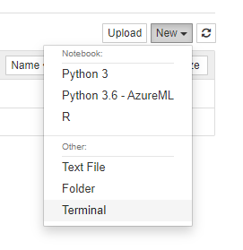
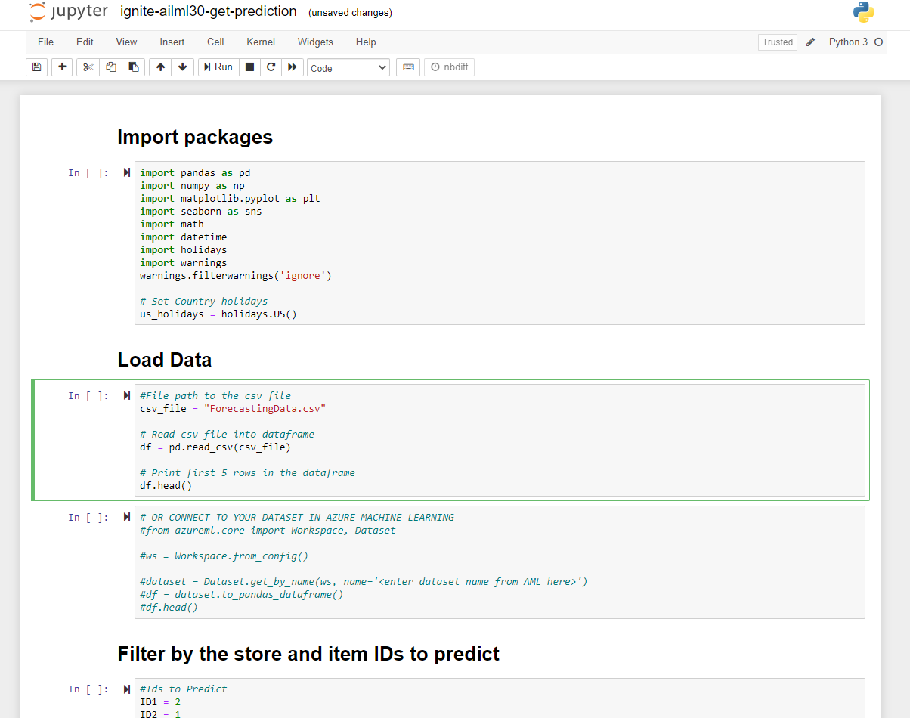

# Using Jupyter for Data Prep Stage

> If you do not want to use Jupyter Lab - follow the instructions below

1. Navigate to your 'Compute instances' in the Compute tab
2. Select the `Jupyter` option. (This will not display until the VM is in a `running` state.)
2. Double click the 'Users' folder, and then your alias folder
3. Click 'New' and select 'Terminal' - this will open in a new browser window

4. Clone the repo from the terminal in Jupyter
    * `git clone https://github.com/microsoft/ignite-learning-paths-training-aiml.git`
5. Also in the terminal `pip install holidays`
6. Open the `ignite-learning-paths-training-aiml` cloned folder and navigate to the `ignite-ailml30-get-prediction.ipynb` file and click to open it.
    * The full path should be something like this: `ignite-learning-paths-training-aiml\aiml30\Python\ignite-ailml30-get-prediction.ipynb`
7. Upload the dataset you downloaded from the repository 'ForecastingData.csv' into the Jupyter environment in the same folder as the ignite-ailml30-get-prediction.ipynb file
8. Update the path to the csv file. If its in the same folder as the ignite-ailml30-get-prediction.ipynb file then edit the path to 'ForecastingData.csv'
9. Run and review all data processing cells until you reach 'Create function to get prediction from API' - we will revisit this notebook again later in the workshop

## Now return to the workshop for [the next task](workshop-instructions.md#3-start-building-the--model)