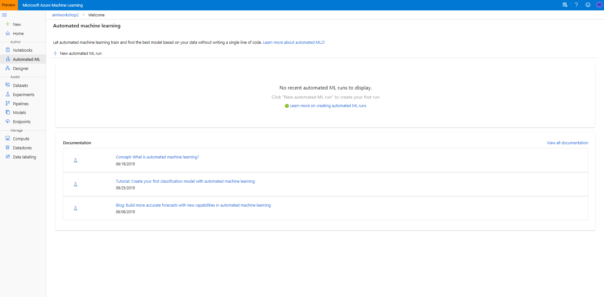
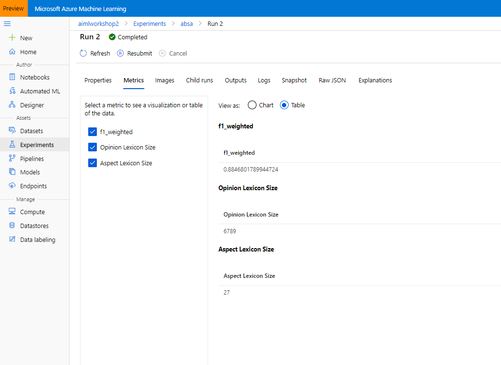
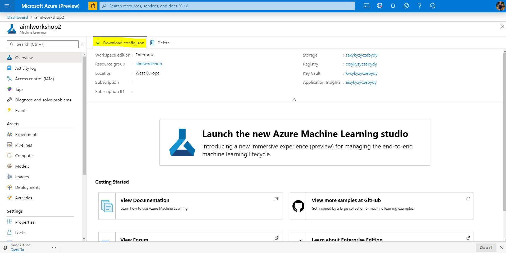
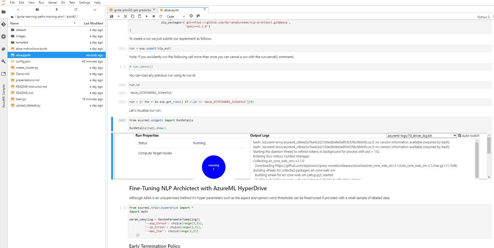
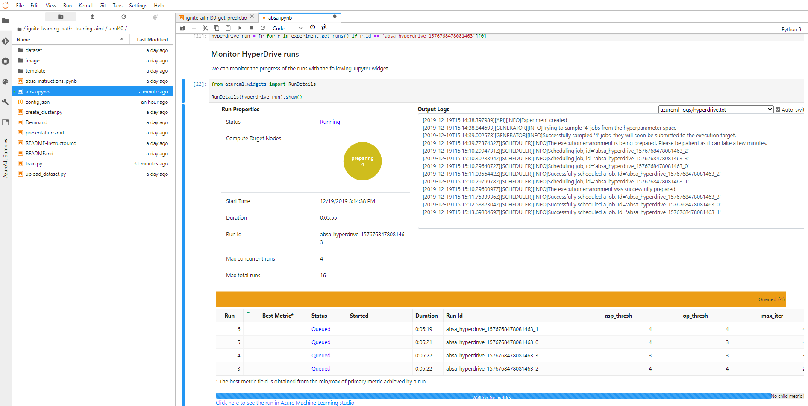

# Workshop 3:
# Taking Models to the Next Level with Azure Machine Learning Best Practices

## Workshop Abstract
Artificial Intelligence and Machine Learning can be used in many ways to increase productivity of business processes and gather meaningful insights, by analyzing images, texts and trends within unstructured flows of data. While many tasks can be solved using existing models, in some cases it is also required to train your own model for more specific tasks, or for increased accuracy. 

In this session, we will explore the complete path of integrating text analysis intelligent services into the business processes of [Tailwind Traders](http://tailwindtraders.com), starting from pre-built models available as [cognitive services](https://azure.microsoft.com/services/cognitive-services/?WT.mc_id=msignitethetour2019-github-aiml40), up to training a third-party neural custom model for [Aspect-Based Sentiment Analysis](https://www.intel.ai/introducing-aspect-based-sentiment-analysis-in-nlp-architect/) available as part of [Intel NLP Architect](http://nlp_architect.nervanasys.com/) using [Azure Machine Learning](https://azure.microsoft.com/services/machine-learning-service/?wt.mc_id=msignitethetour2019-github-aiml40). We will talk about cases when one needs a custom model, and demonstrate quick ways to create such a model from scratch using [AutoML](https://docs.microsoft.com/azure/machine-learning/service/concept-automated-ml/?wt.mc_id=msignitethetour2019-github-aiml40), and show how to fine-tune model hyperparameters using [HyperDrive](https://docs.microsoft.com/azure/machine-learning/service/how-to-tune-hyperparameters/?wt.mc_id=msignitethetour2019-github-aiml40)

## Pre-reading

* **Azure Basics**
    * I would recommend getting a basic understanding of cloud technologies and Azure (storage, VMs and networking) from [Azure Fundamentals](https://docs.microsoft.com/en-us/learn/paths/azure-fundamentals/?WT.mc_id=aimlworkshop-github-amynic) 
* **Azure AI introduction**
    * (Prebuilt AI) [Classify images](https://docs.microsoft.com/en-us/learn/paths/classify-images-with-vision-services/?WT.mc_id=aimlworkshop-github-amynic) 
    * (Prebuilt AI) [Evaluate Text](https://docs.microsoft.com/en-us/learn/paths/evaluate-text-with-language-services/?WT.mc_id=aimlworkshop-github-amynic) 
    * (Data Science) [Using Python and Azure Notebooks](https://docs.microsoft.com/en-us/learn/paths/intro-to-ml-with-python/?WT.mc_id=aimlworkshop-github-amynic)
    * (Bespoke Machine Learning) [Introduction to Azure Machine Learning](https://docs.microsoft.com/en-us/learn/paths/build-ai-solutions-with-azure-ml-service/?WT.mc_id=aimlworkshop-github-amynic)
* **General other interesting learning:**
    * (Theory/approaches) [Machine Learning Crash Course](https://docs.microsoft.com/en-us/learn/paths/ml-crash-course/?WT.mc_id=aimlworkshop-github-amynic)
    * [Principles for Responsible AI](https://docs.microsoft.com/en-us/learn/modules/responsible-ai-principles/?WT.mc_id=aimlworkshop-github-amynic)

## Pre-requisites

* Laptop with a modern web browser (Edge, Chrome etc)
* Access to a [Azure Subscription](https://azure.microsoft.com/en-us/free/students/?WT.mc_id=aimlworkshop-github-amynic)
* [Visual Studio Code](https://code.visualstudio.com/?WT.mc_id=aimlworkshop-github-amynic)
* Basic understanding of how to access code and instructions from [GitHub](https://guides.github.com/)

## Environment Setup

>*If you have completed Workshop 2 you DO NOT need to use the deploy to Azure button below. You will reuse the same Azure Machine Learning workspace and you can also reuse compute targets if you already have them created*

### Upload Automated ML Dataset

* There is a dataset for Automated ML task - [clothing_automl.xlsx](/dataset/clothing_automl.xlsx)
* Go to Datasets in the Azure Machine Learning Studio
* Click `Create dataset` and 'From local files'
* Browse for the dataset downloaded
* On Settings and Preview Step: Make sure the column headers are set properly
* Click Create to complete 

### Create Compute Targets
1. Create Notebook VM
    * Click on the nav "Compute"
    * Click "New"
    * Enter a name for your notebook VM
    * Click Create

2. Create Training Compute
    * Click on the nav "Compute"
    * Select 'Training Clusters'
    * Click "New"
    * Enter a name for the resource
    * Select "Machine Learning Compute" from the dropdown
    * Select the machine size, e.g. Standard_D3_v2
    * Select Low Priority
    * Enter the min and max nodes (recommend min of 0 and max of 5)
    * Click "Create"
    

## Task 1: Azure Cognitive Services Review

In this task, you will review how Text Analytics can do sentiment analysis of a phrase within a web interface.

1. Open the [Azure Cognitive Services Text Analytics Page](https://azure.microsoft.com/services/cognitive-services/text-analytics/?WT.mc_id=msignitethetour2019-github-aiml40)
2. Scroll down to **see it in action** section and enter the phrase *I loved the polka dot trousers that I bought in the london store* (You can also leave the default phrase to demonstrate the point).
3. Press **Analyze** to get the following result:

Note that Text Analytics does not only provide sentiment, but also extracts location and key words from text.

However if you put in *I loved the polka dot trousers but didn't like the london store environment* the analysis we were looking for was to analyse the two separate phrases. Lets look at bespoke methods to complete this.

## Task 2: Automated Machine Learning

In this task, you will explore how Automated Machine Learning can be used to build an ML models without coding.

1. Navigate to Azure ML studio
2. Go to **Datasets** - you should see the previously uploaded dataset there (clothing_automl.xlsx).
3. Select the dataset.
4. From the **Explore** tab, have a look at the data.

5. Go to **Automated ML** tab and click **+New Automated ML Run**

6. Choose the clothing dataset to use

7. Enter an experiment name e.g. automl-clothing
8. Select target column -- **Rating**.
9. Select your training compute
10. Chose the type of prediction task -- **Classification**.
11. Select 'View additional configuration settings', review settings and make sure in Exit Criterion, the training job time is set to 1 hour
12. Review all settings available to you
13. Click **Finish**.

*The experiment will take quite a long time to run, move onto Task 3 and revisit the the results in around 15 mins*

Once the experiment has completed you can review the overview in the Jupyter Notebook. But also with the portal
* Go to Azure Machine Learning Studio
* Clicks on Experiments
* Select the 'absa' experiment
* Click the latest run
* Explore the tabs for metrics, information and logs about the experiment

## Task 3: Azure Machine Learning SDK

In this task, we will run custom Python code that uses the Python Azure ML SDK to train, optimize and use the custom Aspect Based Sentiment Analysis (ABSA) model.

All of the instructions for this part of the task are located in the absa.ipynb Jupyter Notebook itself. 

* In Azure Machine Learning Studio, browse to your Notebook VM and log into Jupyter or Jupyter Lab
* In Jupyter upload absa.ipynb notebook
* In the Azure Portal - navigate to the Azure Machine Learning service page and download the config.json file

* Upload the config.json file to the Notebook VM Jupyter environment
* Open Notebook, follow instructions and run each cell step by step reading the code and reviewing the Azure ML SDK
* Confirm in the top left corner the Kernel is set to 'Python 3.6 - AzureML' - if not select 'kernel' from the menu, 'change kernel', 'Python 3.6 - AzureML'
* Read through all instructions in the notebook before running each cell
* Downloading the dataset will take a few minutes so review the rest of the notebook whilst this is downloading

In this notebook you will:
* Connect from jupyter notebook to the Azure Machine Learning Service (using a config.json file)
* Upload datasets to the Azure Machine Learning Studio
* Create a train.py file
* Create an experiment
* Create a compute environment setup that will be able to run your train.py script
* Submit an experiment
* Review the experiment running

* Fine tune the experiment using Hyperparameter tuning

### Congratulations you have built a bespoke open source NLP model using Azure Machine Learning SDK and Studio

> This is the last workshop you are completing so don't forget to delete all your resources to save Azure cost. Go to the Azure Portal, select AIML20, AIML30 and AIML40 Resource groups and click delete and type the name of the resource group to confirm deletion.

## Resources and Continue Learning

### Getting Started Series

* [Azure Cognitive Services Text Analytics API](https://aka.ms/TextCogSvc)
* [Automated Machine Learning](https://aka.ms/AutomatedMLDoc)
* [Hyperparameter Tuning](https://aka.ms/AzureMLHyperDrive)
* [Azure ML Services and the Python SDK](https://aka.ms/AA3dzht)

### Other Materials

* [9 Advanced Tips for Production Machine Learning](http://aka.ms/9TipsProdML)
* [Intel Aspect-Based Sentiment Analysis Page](https://www.intel.ai/introducing-aspect-based-sentiment-analysis-in-nlp-architect/)
* Azure ML Best Practice Repos:
    * [Natural Language Processing](https://github.com/microsoft/nlp/)
    * [Computer Vision](https://github.com/microsoft/ComputerVision)
    * [Recommenders](https://github.com/microsoft/Recommenders)

